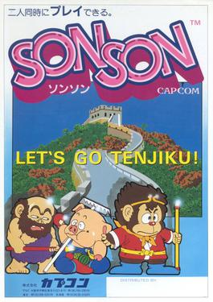

# [Arcade: Capcom SonSon](https://en.wikipedia.org/wiki/SonSon) for [MiSTer](https://mister-devel.github.io/MkDocs_MiSTer/)



Based on PACE code by [Mark McDougall(tcdev)](http://members.iinet.net.au/~msmcdoug/)

Developed by [Slingshot](https://atari-forum.com/memberlist.php?mode=viewprofile&u=27648) for [MiST](https://github.com/Gehstock/Mist_FPGA/tree/master/Arcade_MiST/Capcom%20SonSon)

Ported to MiSTer by [Mike Simone](https://github.com/MikeS11)

## Description

This is a simulation model of the **Capcom SonSon** Arcade hardware.

Original source is located in `docs/`

## Controls

## To-Do

*Add Hi Scores

## ROM Files Instructions

ROMs are not included! In order to use this arcade core, you will need to provide the correct ROM file yourself.

To simplify the process .mra files are provided in the releases folder, that specify the required ROMs with their checksums. The ROMs .zip filename refers to the corresponding file from the MAME project.

Please refer to [Arcade Roms and MRA files](https://mister-devel.github.io/MkDocs_MiSTer/developer/mra/) for information on how to setup and use the environment.

Quick reference for folders and file placement:

```
/_Arcade/<game name>.mra  
/_Arcade/cores/<game rbf>.rbf  
/_Arcade/mame/<mame rom>.zip  
/_Arcade/hbmame/<hbmame rom>.zip  
```
